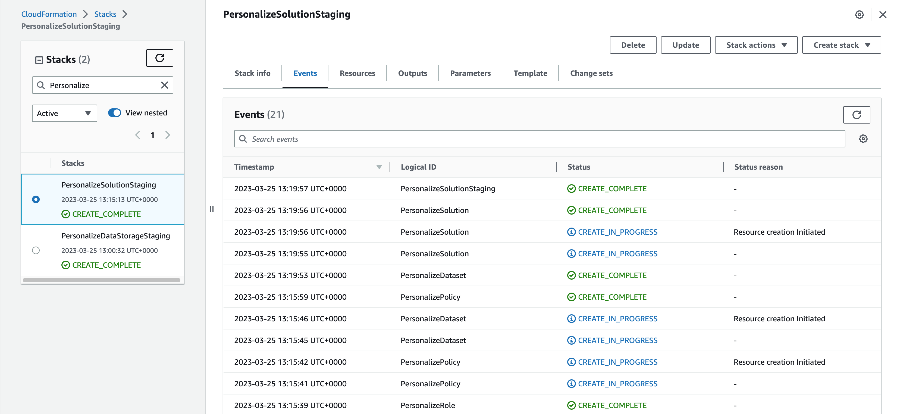
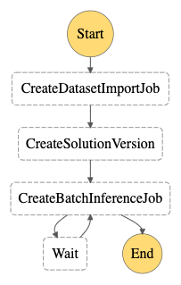

#

[main read](https://aws.amazon.com/blogs/machine-learning/create-a-batch-recommendation-pipeline-using-amazon-Personalize-with-no-code/)

[ glue immersion day](https://catalog.us-east-1.prod.workshops.aws/workshops/ee59d21b-4cb8-4b3d-a629-24537cf37bb5/en-US/lab1/create-crawler-CloudFormation)
------------------------------------------------------------------------
# Author Bio

Mike Shakhomirov
Head of Data Engineering at The World's Online Festival. MBA. Google Cloud Certified Professional Data Engineer. MIT diploma in Big Data and Social Analytics.
https://www.linkedin.com/in/mshakhomirov/
Passionate and digitally focussed individual with an abundance of drive and enthusiasm, loving the challenges the full mix of digital marketing can offer.
I am an official writer for such publications as Towards Data Science and The Startup with more than 20 published articles on various topics. I write about Data Engineering, Machine learning and AI in Digital Marketing. 
Read more: https://www.medium.com/@mshakhomirov/

With over twenty years of experience in data analytics, corporate banking risk units, and digital marketing, I have obtained considerable expertise in risk management, data engineering and mathematical modelling, statistical analysis, business administration, and marketing.

After having completed my MBA at Newcastle I worked with numerous start up companies in the UK in building BI systems, designing data pipelines, machine learning models and implementing genetic algorithms. These roles allowed me to apply combined marketing and data handling skills and I feel that a career in data driven marketing or computer science and artificial intelligence is definitely something I would like to pursue. These are engaging and interesting fields that allow the practical application of data science in an extremely rewarding way, as well as room for continuing professional development, innovation, implementing novel ideas and contributing to a constantly evolving field.

------------------------------------------------------------------------

# LP3 Intro
This Project shows how to create a machine learning data pipeline with AWS Glue and AWS Personalize.

Work with a Movielens dataset and user ratings stored in AWS S3 datalake bucket. Create machine learning pipelines with AWS Glue feeding data into AWS Personalize. Deploy it with Infrastructure as Code. After a required data transformation AWS Personalize will generate movie recommendations. Learn how to orchestrate the pipeline using AWS Step Functions.

**Data Pipeline**
1. Prepare data using AWS Glue

2. Train AWS Personalize solution


## Scenario
Imagine that you have just joined a mobile app company as a Data Engineer. Your company’s product is called MainRo. MainRo is a messenger application with popular features of anonymity, VR and stage broadcasts.  You are tasked with creating an end-to-end data project connecting various data sources to your new lake house solution. This includes user engagement events, stage controls and public chat messaging.

Your data stack is modern, event-driven, cost-effective, flexible (you can connect any data source you want), and can scale easily to meet the growing data resources you have. Your company is a mobile game development studio and has various products sold on both iOS and Android platforms.

Your data platform architecture includes a data lake (AWS S3 and Athena) and a modern data warehouse solution (AWS Redshift). It is fast and effective, with close to real-time data pipelines monitored daily. It has data quality control procedures in place. External data sources and data pipelines in your data platform are managed by the data engineering team using a flexible environment setup with CI/CD GitHub integration.

As a data engineer, you are tasked with designing three data pipelines that will process the data in the data lake and in the data warehouse to create analytics dashboards. All data files come from various data sources, i.e. databases, kinesis firehose streams, and various notification services in different formats (CSV, JSON, PARQUET, etc.) and are stored in AWS S3. Also, you need to create a POC project using a new tool called AWS Personalize to serve better product recommendations for users.

In this project you were tasked to create a machine learning pipeline using a new tool called AWS Personalize to serve better product recommendations to users. It appears that AWS Personalize is the right choice as you don't need to worry about the machine learning model. You just need to design the data pipeline that feeds the user interactions to the AWS Personalize API. You decided to use AWS Glue to process user engagement data stored in AWS S3 to send it to AWS Personalize to train the solution. After that, the server team will be able to get updated product recommendations for users. You will use AWS CloudFormation templates to provision some of the resources required for your data pipeline. Those templates will be provided in the project.

## Techniques, tools and libraries
- AWS SDK
- AWS CLI
- Python 3.8
- Bash scripting
- AWS Personalize
- AWS Glue

## Keywords
datalake, AWS, serverless, lambda function, step functions, data architecture, ETL, data pipeline, AWS Glue, PySpark, AWS Personalize.

## Audio files

Hi, I am Mike Shakhomirov, and I would like to introduce my Manning liveProject – ML Pipeline with AWS Personalize.

This project is the third of the three part series titled  Become a Data Engineer with Amazon Web Services.

* In This Project We will use a MovieLens data source in our data lake storage to create a recommendation system.
* We will deploy a data pipeline using Step Functions and AWS CloudFormation.
* Finally  we will Import prepared dataset and train AWS Personalize solution for our recommendation engine.


## Project outline 
This project has three milestones and estimated duration is 8 hours.
### 1. Create datalake S3 bucket using AWS CloudFormation template and prepare data using AWS Glue
### 2. Import prepared dataset and create/train AWS Personalize solution

### 3. Create a data pipeline using AWS Step Functions


**Overview**

We will use a MovieLens dataset as a data source:
- [MovieLens dataset](https://grouplens.org/datasets/hetrec-2011/)

Data transformation/preparation is an essential part of data engineering (for machine learning) process and ensures user enagagement and behavoiur data is prepared for AWS Personalize so t could create recommendations for each of these users.


**Pricing**
- [AWS Glue](https://aws.amazon.com/glue/pricing/)

The AWS Glue visual editor launches an Apache Spark session to sample our source data and run required transformations. This session lasts 30 minutes before shutting down automatically. AWS would charge us for two DPUs at the development endpoint rate (DEVED-DPU-Hour), which amounts to $0.44 each 30 minute session. 

- [AWS Personalize](https://aws.amazon.com/Personalize/pricing/)
AWS Personalize has a Free tier:

Amazon Personalize charges us per GB of data uploaded into the service. This includes data sent in real time to Amazon Personalize as well as bulk data uploaded using Amazon Simple Storage Service (S3).

When we use Custom Recommendation Solutions for the first two months after signing up, we would have the following benefits:
* Data processing and storage: Up to 20 GB per month per eligible AWS Region.
* Training: Up to 100 training hours per month per eligible Region.
* Recommendations: Up to 50 TPS-hours of real-time recommendations/month.

**Pricing examples provided by AWS:**

ETL job: Consider an AWS Glue Apache Spark job that runs for 15 minutes and uses 6 DPU. The price of 1 DPU-Hour is $0.44. Since your job ran for 1/4th of an hour and used 6 DPUs, AWS will bill you 6 DPU * 1/4 hour * $0.44, or $0.66.

AWS Glue Studio Job Notebooks and Interactive Sessions: Suppose you use a notebook in AWS Glue Studio to interactively develop your ETL code. An Interactive Session has 5 DPU by default. If you keep the session running for 24 minutes or 2/5th of an hour, you will be billed for 5 DPUs * 2/5 hour at $0.44 per DPU-Hour or $0.88.


---------------------------------------------------------------
# Prerequisites and Resources

This project is for intermediate Python programmers who would like to choose a data engineer or BI developer career path and might be tasked with building a machine learning data pipeline using AWS Glue, AWS S3, and AWS Personalize.

* TOOLS
   * AWS Account
   * Basic understanding of cloud computing (Amazon Web Services)
   * Shell (Command line interface) commands and scripting (Advanced).
   * Python 3.8 installed on your machine.
   * Basic knowledge of serverless infrastructure, i.e. AWS Lambda.
   * AWS CLI (AWS Command Line Interface) installed.
   * AWS Glue
   * AWS S3
   * AWS Step Functions
   * AWS CloudFormation

* TECHNIQUES
   * Basic knowledge of SQL, i.e. MySQL database.
   * Basic knowledge of `Python` (intermediate). You will create a Lambda Function. 
        * basic debugging (consoles, print statements)
        * loops: i.e. `for`
        * branches: if, if/else, switches
   * Shell commands and scripting as you would want to deploy you Lambda using `AWS CLI` from command line. 


# Recommended resources	

These resources, identified by the author, can directly impact or expand your understanding of the liveProject's content. These resources **do not** need to be read in advance of starting the project. 

(free only) If you DO NOT own the whole series, please note: This is a free project so these resources are not included in the 90-day full access of Manning materials, and you will only see the excerpts that the author has selected to include in the project. These excerpts will appear in pop-up windows once you click on the appropriate links - for more information read the How to Use Help section.

(free only) If you DO own the whole series, please note: You will have full access to these Manning materials for the first 90 days after starting the project in addition to the excerpts within the project. After 90 days, you will still have access to the excerpts, and you will only be able to see a preview of the resources if viewed outside the project.

(other projects) Please note: You will have full access to these Manning materials for the first 90 days after starting the project in addition to the excerpts within the project. After 90 days, you will still have access to the excerpts, and you will only be able to see a preview of the resources if viewed outside the project.

* [Manning Book: Designing cloud data platforms ](https://livebook.manning.com/book/designing-cloud-data-platforms/welcome/v-8/)
* [Serverless Architectures on AWS, Second Edition](https://www.manning.com/books/serverless-architectures-on-aws-second-edition?query=Serverless%20Architectures%20on%20AWS)
* [Manning Book: AWS Lambda in Action](https://livebook.manning.com/book/aws-lambda-in-action/about-this-book/)
* [Outside resource 1. AWS Free Tier](https://docs.aws.amazon.com/awsaccountbilling/latest/aboutv2/free-tier-limits.html)
* [Outside resource 2. AWS Lambda](https://aws.amazon.com/lambda/)
* [Outside resource 3. AWS CLI](https://aws.amazon.com/cli/)
* [Outside resource 3. AWS Personalize dataset requirements](https://docs.aws.amazon.com/Personalize/latest/dg/interactions-dataset-requirements.html)
* [Outside resource 4. AWS State Machine Input and Output](https://docs.aws.amazon.com/step-functions/latest/dg/input-output-inputpath-params.html)

We provide additional resources and tutorials throughout the project. Feel free to use any resources you can find to complete the project. If you run into problems or have questions, refer to the [Frequently Asked Questions (FAQs)]() section.

----------------------------------------------------------------------------
# Setup

***Dataset***<br>
When you set up your project-specific repo, you will automatically receive the dataset for this project. 
We will use a MovieLens dataset as a data source:
- [MovieLens dataset](https://grouplens.org/datasets/hetrec-2011/)

***Libraries and setup***<br>
Please refer to the Prerequisites section. You will need those tools installed on your machine.


***Technology versions***<br>

|&nbsp;&nbsp; Technology &nbsp;&nbsp;|&nbsp;&nbsp; Minimum Version Required &nbsp;&nbsp;|&nbsp;&nbsp; Max Supported (Current) Version &nbsp;&nbsp;|
| :-----------: | :-----------: | :-----------: |
| Python | 3.8 | 3.8 |
| AWS Glue | 3.0 | 3.0 |
| AWS CLI | 2.4.3 | 2.* |

***Disclaimer***

All services used in this live project are available under AWS Free tier.

----------------------------------------------------------------------------

# Milestone 1
# Provision the resources required for our data pipeline using AWS CloudFormation template

**Objective**
* Familiarize yourself with AWS CloudFormation templates to provision the resources required for the data pipeline. Those templates will be provided in the project.
* Learn how to use AWS Glue to prepare the data.

**Importance to project**

This Project explains how to create a machine learning data pipeline with AWS Glue and AWS Personalize.
First of all, we would want to provide the required resources for our data pipeline, i.e. AWS S3 bucket and AWS Glue transformations to prepare the data. The most reliable way to do so is to provide resources using Infrastructure as Code (IAC). Familiarizing with AWS CloudFormation is important because it simplifies adding new resources to our stack. It also helps to avoid any potential human errors, i.e. misspelt resource names, etc.

**Workflow**

Use CloudFormation templates from the [project repository](https://github.com/manning-liveproject/build-a-ml-pipeline-in-aws-lake-house-lp-author) to create the required resources. Adjust S3 bucket and Stack names.

1. Create data lake S3 bucket using AWS CloudFormation template

```sh
# rename STACK and S3 parameters to match your environment:
STACK=GlueS3Staging
S3=your.s3.bucket
aws \
CloudFormation deploy \
--template-file glue_s3_stack.yaml \
--stack-name $STACK \
--capabilities CAPABILITY_IAM \
--parameter-overrides \
"SourceDataBucketName"=$S3
```


Check that the bucket exists.


2. Use AWS Glue to transform raw user engagement data

We will use AWS Glue and its Graphical User Interface (GIU) feature for ETL jobs to transform the data. The data must have the format required by AWS Personalize. Every time users give ratings to movies they interact ad provide very useful data (`interactions`). AWS Personalize requires the following schema for that dataset:
- user_id (string)
- item_id (string)
- timestamp (long, in Unix epoch time format)

You can find more about it in official AWS documentation [here](https://docs.aws.amazon.com/Personalize/latest/dg/interactions-dataset-requirements.html)

* Download the MovieLens dataset and load `user_ratedmovies-timestamp.dat` into our `/raw` folder. 
    It has 48K interactions which should be enough to train AWS Personalize model. It will cost less than $0.05 to perform an ETL job on it.

```sh
# Change glue.staging.aws to your bucket name, it must be unique:
GLUE_S3=glue.staging.aws
aws s3 cp ./hetrec2011-movielens-2k-v2/user_ratedmovies-timestamps.dat s3://${GLUE_S3}/raw/user_ratedmovies-timestamps.dat
# upload: hetrec2011-movielens-2k-v2/user_ratedmovies-timestamps.dat to s3://glue.staging.aws/raw/user_ratedmovies-timestamps.dat
```
- `user_ratedmovies-timestamp.dat` sample:
```sh
# user_ratedmovies-timestamp.dat
userID	movieID	rating	timestamp
75	3	1	1162160236000
75	32	4.5	1162160624000
75	110	4	1162161008000
```
We would want to transform this dataset to meet AWS Personalize requirements:
```sh
USER_ID,ITEM_ID,TIMESTAMP
75,32,1162160624000
75,110,1162161008000
```

* Open AWS Glue Studio > Jobs and create one to transform our `/raw` dataset into `/transformed` that has a schema suitable for AWS Personalize. 


**Important**
Make sure that AWS Glue is using relevant S3 access permissions, i.e. it can access the bucket in question.


If everything goes well then you will be able to see the successful result:


**Deliverable**

The deliverable for this milestone is a simple, yet fully functioning data transformation job.


Feel free to deploy it any way you like, i.e. using AWS CLI, CloudFormation or Visual Editor in AWS console.

## Help
Please feel free to refer to these Manning resources to understand how to work with AWS services to design the data platform architecture:
* [Manning Book: Designing cloud data platforms ](https://livebook.manning.com/book/designing-cloud-data-platforms/welcome/v-8/).
[In Chapter 4 you can find information about how to get the data into the data platform. It explains the way and possible data sources](https://livebook.manning.com/book/designing-cloud-data-platforms/chapter-4/20).
[In Chapter 5 and 6 you read about data transformation techniques. It explains the way prepare and process our dataset](https://livebook.manning.com/book/designing-cloud-data-platforms/chapter-4/20).
* [Manning Book: Amazon Web Services in Action, Third Edition ](https://www.manning.com/books/amazon-web-services-in-action-third-edition).


### Hints for Step 2
* Try Visual ETL Editor to create a simple Workflow using the following nodes:
- Data Source
- Apply Mapping
- Data target

* In the first node use `CSV` as a format. Indicate that data is `TAB` delimited:

```json
...
			"separator": "\t",
			"quoteChar": "\"",
			"withHeader": true,
			"escaper": ""
```

* In `Apply mapping` use the following schema transformations:


```json
"mapping": [
				{
					"toKey": "USER_ID",
					"fromPath": [
						"userID"
					],
					"toType": "string",
					"fromType": "string",
					"dropped": false
				},
				{
					"toKey": "ITEM_ID",
					"fromPath": [
						"movieID"
					],
					"toType": "string",
					"fromType": "string",
					"dropped": false
				},
				{
					"toKey": "rating",
					"fromPath": [
						"rating"
					],
					"toType": "string",
					"fromType": "string",
					"dropped": true
				},
				{
					"toKey": "TIMESTAMP",
					"fromPath": [
						"timestamp"
					],
					"toType": "long",
					"fromType": "string",
					"dropped": false
				}
			],
```


### Hints for Step 2
* Open AWS Glue Studio > Jobs and create one to transform our `/raw` dataset into `/transformed` that has a schema suitable for AWS Personalize. 


Use `/transformed` prefix for our job output.


Save and run the job. Check that the file has been successfully transformed:
```sh
# Replace glue.staging.aws with your bucket name:
GLUE_S3=glue.staging.aws
aws s3 cp s3://${GLUE_S3}/transformed/ ./hetrec2011-movielens-2k-v2/transformed/ --recursive
# download: s3://glue.staging.aws/transformed/run-1682272671735-part-r-00000 to hetrec2011-movielens-2k-v2/transformed/test/run-1682272671735-part-r-00000
```

### Author insights

We can use `Preview` dataset to check the files in the bucket:


## Partial solution
Partial solution is not required for this Milestone.

## Full solution
When S3 and IAM resources are created use the final solution job file `glue_job_full_solution.py`
Upload it to your S3 bucket and deploy with the following CloudFormation template:

```sh
# Change variables below names to match your environment.
# also replace your.s3.bucket with your glue S3 data bucket in glue_job_full_solution.py
STACK=GlueJob
GLUE_S3=glue.staging.aws
SCRIPT_LOCATION=s3://${GLUE_S3}/glue_scripts/glue_job_full_solution.py

aws s3 cp ./glue_job_full_solution.py $SCRIPT_LOCATION
# aws s3 cp ./glue_job_full_solution.py s3://<YOUR_GLUE_BUCKET>/glue_scripts/glue_job_full_solution.py

aws \
CloudFormation deploy \
--template-file glue_job.yml \
--stack-name $STACK \
--capabilities CAPABILITY_IAM \
--parameter-overrides \
"ScriptLocation"=$SCRIPT_LOCATION \
"SourceDataBucketName"=$GLUE_S3
```


### FAQ: 
1. I keep getting this error while running Glue job:
```sh
An error occurred while calling o107.pyWriteDynamicFrame. No such file or directory 's3://glue.staging.aws/raw/user_ratedmovies-timestamps.dat'
```

Answer: Make sure that user_ratedmovies-timestamps.dat file exists in that location.
Also make sure that AWS Glue is using the correct IAM role so it can access the S3 bucket, i.e. policy must allow access to that bucket:
```json
{
    "Version": "2012-10-17",
    "Statement": [
        {
            "Action": [
                "s3:*",
                "s3-object-lambda:*"
            ],
            "Resource": [
                "arn:aws:s3:::glue.staging.aws",
                "arn:aws:s3:::glue.staging.aws/*"
            ],
            "Effect": "Allow"
        }
    ]
}
```
Also make sure that standard AWS managed policy for AWS Glue has been attached to your role:
```yaml
ManagedPolicyArns: 
        - arn:aws:iam::aws:policy/service-role/AWSGlueServiceRole
```

2. I am runnning Glue job and get this error:
```sh
LAUNCH ERROR | Error downloading from S3 for bucket: aws-glue-assets-677619093471-eu-west-1, key: scripts/Glue test job.py.Access Denied (Service: Amazon S3; Status Code: 403; Please refer logs for details.
```
Answer: The IAM Role will need access to the S3 bucket it cannot access. The AWSGlueServiceRole policy only gives the ability to GetObject from resources names aws-glue-*. You will need to attach another policy or create your own policy to run the glue jobs on that S3 bucket.
More info can be found [here](https://docs.aws.amazon.com/glue/latest/dg/glue-troubleshooting-errors.html)


-------------------------------------------------------------------------------------

# Milestone 2
## Import prepared dataset and create AWS Personalize solution

**Objective**
* Familiarize yourself with AWS Personalize concepts such as datasets and solutions to provision the resources required for the data pipeline.
* Learn how to train the machine learning model with AWS Personalize.

**Importance to the project**

This Project explains how to create a machine learning data pipeline with AWS Glue and AWS Personalize.
In Milestone 1 we created resources for our data pipeline, i.e. AWS S3 bucket and AWS Glue transformations to prepare the data. AWS Personalize is a modern no-code service to train recommendation models. It is a machine-learning service that uses user engagement data to generate item recommendations for customers.
We just need to design the data pipeline that feeds the user interactions to the AWS Personalize.

**Workflow**

1. Create an AWS Personalize dataset group and a dataset
There are three types of datasets in AWS Personalize:
- Interactions (we will use this one)
- Items
- Users

2. Create dataset group
- Describe the dataset schema for our interactions dataset
- Describe AWS Personalize permissions so it can access the data in S3:
```json
{
   "Version":"2012-10-17",
   "Id":"PersonalizeS3BucketAccessPolicy",
   "Statement":[
      {
         "Sid":"PersonalizeS3BucketAccessPolicy",
         "Effect":"Allow",
         "Principal":{
            "Service":"Personalize.amazonaws.com"
         },
         "Action":[
            "s3:GetObject",
            "s3:ListBucket",
            "s3:PutObject"
         ],
         "Resource":[
            "arn:aws:s3:::<your-bucket-name>",
            "arn:aws:s3:::<your-bucket-name> /*"
         ]
      }
   ]
}
```
3. Create a dataset schema in AWS Personalize.
Typical AWS Personalize schema will look like this. We will use it:
```json
{

  "type": "record",
  "name": "Interactions",
  "namespace": "com.amazonaws.Personalize.schema",
  "fields": [
      {
          "name": "USER_ID",
          "type": "string"
      },
      {
          "name": "ITEM_ID",
          "type": "string"
      },
      {
          "name": "TIMESTAMP",
          "type": "long"
      }
  ],
  "version": "1.0"
}
```

4. Create AWS Personalize solution
Use `Item recommendation` type and `aws-user-personalization` recipe.
It might take approximately 20 minutes to train the model using our user interaction data.

5. Create batch inference job

Use data from `batch_users_input` folder:
```json
// s3://<YOUR_GLUE)BUCKET/batch_users_input/file>
{"userId":"75"}
{"userId":"78"}
{"userId":"127"}
```
For output data choose the s3 bucket we created earlier with the suffix `/recommendations`

```sh
aws s3 cp ./hetrec2011-movielens-2k-v2/transformed/batch_user_input/three_user_input  s3://glue.staging.aws/batch_users_input/three_user_input

```


**Deliverable**

The deliverable for this milestone is a simple, yet fully functioning AWS Personalize solution.


Feel free to deploy it any way you like, i.e. using AWS CLI, CloudFormation or Visual Editor in AWS console.


## Author insights
All AWS Personalize resources can be created using AWS CloudFormation.
For instance, a dataset schema can be created like so:
```yaml
  PersonalizeDatasetSchema:
    Type: AWS::Personalize::Schema
    Properties: 
      # Domain: String
      Name: movie-ratings-schema
      Schema: "{\"type\":\"record\",\"name\":\"Interactions\",\"namespace\":\"com.amazonaws.Personalize.schema\",\"fields\":[{\"name\":\"USER_ID\",\"type\":\"string\"},{\"name\":\"ITEM_ID\",\"type\":\"string\"},{\"name\":\"TIMESTAMP\",\"type\":\"long\"}],\"version\":\"1.0\"}"
```
AWS Personalize accepts AVRO schema definitions.
Read more about it [here](https://docs.oracle.com/database/nosql-12.1.3.0/GettingStartedGuide/avroschemas.html)

Batch inference jobs generate batch item recommendations for users based on Amazon S3 input data. The input data might be a JSON list of users or objects. A batch inference task may be created using the Amazon Personalize interface, the AWS Command Line Interface (AWS CLI), or AWS SDKs.

## Help
Please feel free to refer to these Manning resources to understand how to work with AWS services to design the data platform architecture:
* [Manning Book: Amazon Web Services in Action, Third Edition ](https://www.manning.com/books/amazon-web-services-in-action-third-edition). 
Refer to [Chapter 4 Programming Your Infrastructure: The command line, SDKs and CloudFormation](https://livebook.manning.com/book/amazon-web-services-in-action-third-edition/chapter-4/v-10/search-9)


### Hint for Step 3
Before we can actually get recommendations we need to create a solution [version](https://docs.aws.amazon.com/Personalize/latest/dg/creating-a-solution-version.html)
We can do it via AWS web console or using AWS CLI.
```sh
aws Personalize create-solution-version \
  --solution-arn $SOLUTION_ARN

{
    "solutionVersionArn": "arn:aws:Personalize:eu-west-1:12345678:solution/test-Personalize-movie-solution/aa0adb7f"
}
```


### Hint for Step 3
It might take up to 20 minutes to create a solution version but when it is ready we go and create a batch inference job:


When job is ready you should be able to see recommendations in our datalake bucket under `/recommendations` folder:
```json
{"input":{"userId":"4638"},"output":{"recommendedItems":["63992","115149","110102","148626","148888","31685","102445","69526","92535","143355","62374","7451","56171","122882","66097","91542","142488","139385","40583","71530","39292","111360","34048","47099","135137"],"scores":[0.0152238,0.0069081,0.0068222,0.006394,0.0059746,0.0055851,0.0049357,0.0044644,0.0042968,0.004015,0.0038805,0.0037476,0.0036563,0.0036178,0.00341,0.0033467,0.0033258,0.0032454,0.0032076,0.0031996,0.0029558,0.0029021,0.0029007,0.0028837,0.0028316]},"error":null}
{"input":{"userId":"663"},"output":{"recommendedItems":["368","377","25","780","1610","648","1270","6","165","1196","1097","300","1183","608","104","474","736","293","141","2987","1265","2716","223","733","2028"],"scores":[0.0406197,0.0372557,0.0254077,0.0151975,0.014991,0.0127175,0.0124547,0.0116712,0.0091098,0.0085492,0.0079035,0.0078995,0.0075598,0.0074876,0.0072006,0.0071775,0.0068923,0.0066552,0.0066232,0.0062504,0.0062386,0.0061121,0.0060942,0.0060781,0.0059263]},"error":null}
{"input":{"userId":"3384"},"output":{"recommendedItems":["597","21","223","2144","208","2424","594","595","920","104","520","367","2081","39","1035","2054","160","1370","48","1092","158","2671","500","474","1907"],"scores":[0.0241061,0.0119394,0.0118012,0.010662,0.0086972,0.0079428,0.0073218,0.0071438,0.0069602,0.0056961,0.0055999,0.005577,0.0054387,0.0051787,0.0051412,0.0050493,0.0047126,0.0045393,0.0042159,0.0042098,0.004205,0.0042029,0.0040778,0.0038897,0.0038809]},"error":null}
...
```


## Partial solution
There is no partial solution for this Milestone.

## Full solution

Deploy the complete solution using AWS CloudFormation.
Make sure data files exist in the bucket before running this part.
Files transformed with AWS Glue job from the previous Milestone must be present in DATA_LOCATION:

```sh
# Make sure data files exist in the bucket before running this part.
# Files transformed with AWS Glue job from the previous Milestone
#  must be present in DATA_LOCATION:
DATA_LOCATION=s3://glue.staging.aws/transformed/
STACK_NAME=PersonalizeSolutionStagingTest

aws \
CloudFormation deploy \
--template-file Personalize_basic.yml \
--stack-name $STACK_NAME \
--capabilities CAPABILITY_IAM \
--parameter-overrides \
"DataLocation"=$DATA_LOCATION


# aws \
# CloudFormation update-stack \
# --template-body file://Personalize_basic.yml \
# --stack-name $STACK_NAME \
# --capabilities CAPABILITY_IAM

# https://repost.aws/questions/QUSvocJcK-SA6rNu7QOydbIA/questions/QUSvocJcK-SA6rNu7QOydbIA/aws-CloudFormation-deploy-doesn-t-recognize-change-in-default-value?
#  https://stackoverflow.com/questions/51249700/CloudFormation-wont-deploy-changes-when-default-param-is-changed

# create change_set
DATA_IMPORT_JOB=group-ratings-import-job-test-202304024-3
STACK_ARN=arn:aws:CloudFormation:eu-west-1:677619093471:stack/PersonalizeSolutionStagingTest/11654160-e26b-11ed-a555-062721536c4d
date

TIME=`date +"%Y%m%d%H%M%S"`
CHANGE_SET_ID=$(aws \
CloudFormation create-change-set \
    --stack-name ${STACK_ARN} \
    --change-set-name ChangeSet${TIME} \
    --template-body file://Personalize_basic.yml \
    --capabilities CAPABILITY_IAM \
    --parameters \
        ParameterKey="DatasetImportJobName",ParameterValue="${DATA_IMPORT_JOB}" \
    --query Id \
    --output text
)
change_set_result=($?)
echo  "Command create-change_set executed with code: $change_set_result"
echo "waiting for change-set ${CHANGE_SET_ID} to be created and updating instead..."

aws \
CloudFormation wait change-set-create-complete \
    --change-set-name ChangeSet${TIME} \
    --stack-name $STACK_ARN

aws \
CloudFormation execute-change-set \
    --stack-name $STACK_ARN \
    --change-set-name ChangeSet${TIME}

echo "done"

```

If everything goes well you will see the solution:


## FAQ

3. I am trying to deploy the final solution with cfn template and keep getting this error:
```sh
Resource handler returned message: "Resource of type 'AWS::Personalize::DatasetGroup' with identifier 'Personalize-dataset-group' already exists."
```
Answer: Try renaming the resource mentioned in the response error message. Try to delete the stack and deploy again.

4. I am deploying AW Personalize full solution and keep getting this error:
```sh
Resource handler returned message: "Insufficient privileges for accessing data in S3. Please look at https://docs.aws.amazon.com/Personalize/latest/dg/granting-Personalize-s3-access.html#attach-bucket-policy and fix bucket policy on glue.staging.aws. (Service: Personalize, Status Code: 400
```

```json
  PersonalizePolicy:
    Type: AWS::IAM::Policy
    DependsOn: PersonalizeRole
    Properties:
      Roles:
        - !Ref PersonalizeRole
      PolicyName: 'Personalize-policy'
      PolicyDocument:
        {
          "Version": "2012-10-17",
            "Statement": [
                {
                    "Sid": "",
                    "Effect": "Allow",
                    "Action": [
                        "s3:GetObject",
                        "s3:ListBucket",
                        "s3:PutObject"
                    ],
                    "Resource": "*"
                }
          ]
        }
```

Answer: Make sure AW Personalize can access S3 bucket with data. It must have relevant permission. Also make sure that datalake S3 bucket itself has a policy allowing AWS Personalize to access it:

```yaml
#  glue_S3_stack.yaml
...
Resources:
  PersonalizeBucketPolicy:
    Type: 'AWS::S3::BucketPolicy'
    Properties:
      Bucket: !Ref PersonalizeBucket
      PolicyDocument:
        Statement:
          - Action: '*'
            Condition:
              Bool:
                'aws:SecureTransport': false
            Effect: Deny
            Principal:
              AWS: '*'
            Resource: !Join 
              - ''
              - - !GetAtt 
                  - PersonalizeBucket
                  - Arn
                - /*
            Sid: HttpsOnly
          - Action:
              - 's3:GetObject'
              - 's3:ListBucket'
            Effect: Allow
            Principal:
              Service: Personalize.amazonaws.com
            Resource:
              - !Join 
                - ''
                - - !GetAtt 
                    - PersonalizeBucket
                    - Arn
                  - /*
              - !GetAtt 
                - PersonalizeBucket
                - Arn
          - Action:
              - 's3:GetObject'
              - 's3:ListBucket'
              - 's3:PutObject'
            Effect: Allow
            Principal:
              Service: Personalize.amazonaws.com
            Resource:
              - !Join 
                - ''
                - - !GetAtt 
                    - PersonalizeBucket
                    - Arn
                  - /*
              - !GetAtt 
                - PersonalizeBucket
                - Arn
        Version: 2012-10-17
```

------------------------------------------------------------------------

# Milestone 3
# 3. Create a machine-learning pipeline using AWS Step Functions
## Read for myself
[step pass pinput](https://stackoverflow.com/questions/59056043/aws-step-functions-and-optional-parameters)

## Recommended read external
https://docs.aws.amazon.com/step-functions/latest/dg/input-output-inputpath-params.html

**Objective**
* Familiarize yourself with AWS Personalize resources and AWS Step functions to orchestrate machine learning model training and updates.

**Importance to project**

This Project explains how to create a machine learning data pipeline with AWS Glue and AWS Personalize.
In Milestones 1 and 2 we created resources for our data pipeline, i.e. AWS S3 bucket, AWS Glue transformations to prepare the data and trained the ML model for our user recommendations. AWS Personalize is a modern no-code service to train recommendation models.
In this Milestone we will learn how to orchestrate the workflow using AWS Step Functions.


**Workflow**
Create a State machine (AWS Step Functions)

1. Use `CreateDatasetImportJob`.
If DatasetImportJob with this name has been submitted then `Pass`:

2. Implement a `Wait` logic by adding a `Wait` node. Set it to 20 minutes. In each scenario it is different and some adjustments might be required.
3. Add `CreateSolutionVersion` node afterwards.
If solution version exists with this name then proceed and create a batch inference job:

4. Implement a `Wait` logic by adding a `Wait` node. Set it to 20 minutes. In each scenario it is different and some adjustments might be required.
5. Then add `CreateBatchInferenceJob` after solution is created. (Use `$.SolutionVersionArn` parameter from the previous step)
6. Implement a `Wait` logic by adding a `Wait` node
7. In Error handling for Step 3 (`CreateBatchInferenceJob`) add Catch errors, enter Personalize.ResourceInUseException. Enter `Wait` for Fallback state. enter `$.errorMessage` for `ResultPath`.


**Hints**

We can use Visual Editor to create the required worklow:


**Hint for Step 1:**
Select AWS Personalize node to `CreateDatasetImportJob`. In `Error handling` tab we can add the required error to catch:


**Hints for Steps 2, 4 and 6:**


**Hint for Step 3:**
Add AWS Personalize `CreateSolutionVersion` node like so. In error handling we would want to catch the same error as we did in Step 1:


**Hint for Step 5:**
We would want to create AWS Personalize node with the following configuration:


**Author insights**
In some cases it might be useful to create a step where could load default parameters and pass them in our workflow, i.e. `jobId`.


Then we can configure each step in the same way to use this parameter:


## Partial solution
There is no partial solution for this Milestone.

## Full solution

Deploy the complete solution using AWS CloudFormation.
```sh
DATA_LOCATION=s3://glue.staging.aws/transformed/
STACK_NAME=PersonalizeSolutionStagingTest

aws \
CloudFormation deploy \
--template-file Personalize_step_machine.yml \
--stack-name $STACK_NAME \
--capabilities CAPABILITY_IAM \
--parameter-overrides \
"DataLocation"=$DATA_LOCATION


# If stack already exists then
# create a change_set and execute it:
STACK_NAME=PersonalizeSolutionStagingTest
DATA_LOCATION=s3://glue.staging.aws/transformed/
DATA_IMPORT_JOB=group-ratings-import-job-test-202304024-3
STACK_ARN=arn:aws:CloudFormation:eu-west-1:677619093471:stack/PersonalizeSolutionStagingTest/11654160-e26b-11ed-a555-062721536c4d
date

TIME=`date +"%Y%m%d%H%M%S"`
CHANGE_SET_ID=$(aws \
CloudFormation create-change-set \
    --stack-name ${STACK_ARN} \
    --change-set-name ChangeSet${TIME} \
    --template-body file://Personalize_step_machine.yml \
    --capabilities CAPABILITY_IAM \
    --parameters \
        ParameterKey="DatasetImportJobName",ParameterValue="${DATA_IMPORT_JOB}" \
    --query Id \
    --output text
)
change_set_result=($?)
echo  "Command create-change_set executed with code: $change_set_result"
echo "waiting for change-set ${CHANGE_SET_ID} to be created and updating instead..."

aws \
CloudFormation wait change-set-create-complete \
    --change-set-name ChangeSet${TIME} \
    --stack-name $STACK_ARN

aws \
CloudFormation execute-change-set \
    --stack-name $STACK_ARN \
    --change-set-name ChangeSet${TIME}

echo "done"

```


## Help
Please feel free to refer to these Manning resources to understand how to work with AWS services to design the data platform architecture:
* [Manning Book: Designing cloud data platforms ](https://livebook.manning.com/book/designing-cloud-data-platforms/welcome/v-8/).
In [Chapter 4](https://livebook.manning.com/book/designing-cloud-data-platforms/chapter-4/20) you can find information about how to get the data into the data platform. It explains the way and possible data sources.
[In Chapter 5 and 6](https://livebook.manning.com/book/designing-cloud-data-platforms/chapter-4/20) you read about data transformation techniques. It explains the way prepare and process our dataset.
* [Manning Book: Amazon Web Services in Action, Third Edition ](https://www.manning.com/books/amazon-web-services-in-action-third-edition). 
Refer to [Chapter 4](https://livebook.manning.com/book/amazon-web-services-in-action-third-edition/chapter-4/v-10/search-9) Programming Your Infrastructure: The command line, SDKs and CloudFormation


**Deliverable**

The deliverable for this milestone is a simple, yet fully functioning AWS Personalize solution.


You can use this shell CLI command to download the predicted recommendations:
```sh
aws s3 cp ./hetrec2011-movielens-2k-v2/transformed/batch_user_output/ s3://your.s3.bucket/batch_users_ouput/ --recursive
```
Feel free to deploy it any way you like, i.e. using AWS CLI, CloudFormation or Visual Editor in AWS console.


-----------------------------------------------------


# Summary

AWS Personalize is a great ML tool where we don't need to worry about data science. We just need to design the data pipeline that feeds the user interactions to the AWS Personalize API.
We have created and deployed a machine-learning pipeline where user interactions data is processed with AWS Glue in the datalake.
After that we created a simple workflow to train an AWS Personalize recommendation solution using AWS Step funcitons.
We can create it using the Visual Editor or by using Infrastructure as code templates which can be found in Full solution sections.


This project is part of a series, "Become a Data Engineer with AWS". The other projects are:

* Build a Data Pipeline in AWS with Kinesis, Redshift Data Warehouse, SQL.
* Build a Data Pipeline in AWS Data Lake Connecting Relational Database and Athena


Interested in earning the Certificate of Completion for this liveProject series? Be sure to complete all the projects in the series, then follow the instructions in the final project to connect with your mentor and earn your Certificate!


-----------------------------------------------------


1. Create the bucket with the following structure: `/raw`, `/transformed`, `recommendations`
```sh
aws --profile mds s3 mb s3://data.glue.mshakhomirov
# aws --profile mds s3api put-object --bucket <your_bucket_name> --key <your_folder_name>
aws --profile mds s3api put-object --bucket data.glue.mshakhomirov --key raw/
aws --profile mds s3api put-object --bucket data.glue.mshakhomirov --key transformed/
aws --profile mds s3api put-object --bucket data.glue.mshakhomirov --key recommendations/
```
2. Download the MovieLens dataset and load `user_ratingmovies-timestamp.dat` into our `/raw` folder. 
    It has 48K interactions which should be enough to train AWs Personalize model. It will cost less htan $0.05 to perform an ETL job on it.
```sh
aws s3 --profile mds cp ./hetrec2011-movielens-2k-v2/user_ratedmovies-timestamps.dat s3://data.glue.mshakhomirov/raw/user_ratedmovies-timestamps.dat
```
3. Open AWS Glue Studio > Jobs:


## AWS Glue CloudFormation template
[simple tempalte example](https://docs.aws.amazon.com/AWSCloudFormation/latest/UserGuide/aws-resource-glue-job.html)

[](https://github.com/aws-samples/aws-etl-orchestrator/blob/master/CloudFormation/glue-resources.yaml)
[](https://catalog.us-east-1.prod.workshops.aws/workshops/ee59d21b-4cb8-4b3d-a629-24537cf37bb5/en-US/lab1/create-crawler-CloudFormation)

[Imersion day Glue](https://catalog.us-east-1.prod.workshops.aws/workshops/ee59d21b-4cb8-4b3d-a629-24537cf37bb5/en-US/lab9/cicd-pipeline)


aws --profile mds s3 cp ./batch-Personalize-input-transform-job.py s3://mydataschool.com/glue_scripts/batch-Personalize-input-transform-job.py
```sh
aws --profile mds \
CloudFormation deploy \
--template-file job_test.yaml \
--stack-name GlueJobTest \
--capabilities CAPABILITY_IAM
```

### Check the data after transformation
```sh
aws --profile mds s3 ls s3://data.glue.mshakhomirov

aws s3 --profile mds cp s3://data.glue.mshakhomirov/transformed/batch_user_input/ ./hetrec2011-movielens-2k-v2/transformed/batch_user_input/ --recursive

aws s3 --profile mds cp s3://data.glue.mshakhomirov/transformed/batch_users_input/ ./hetrec2011-movielens-2k-v2/transformed/batch_user_input/ --recursive

aws s3 --profile mds cp s3://data.glue.mshakhomirov/transformed/interactions/ ./hetrec2011-movielens-2k-v2/transformed/interactions/ --recursive
```
### Notes for myself - Copy transformed interactions to pal

```sh
aws s3 cp ./hetrec2011-movielens-2k-v2/transformed/interactions/ s3://Personalize.staging.aws/transformed/interactions/ --recursive

```

## FAQ
1. ### What is unix epoch?


-------------------------
## Create recommendations based on input user data 

### Prerequisites
[](https://docs.aws.amazon.com/Personalize/latest/dg/gs-prerequisites.html)
[Specifying resources with AWS CloudFormation](https://docs.aws.amazon.com/Personalize/latest/dg/creating-resources-with-CloudFormation.html)

### Para
Create a batch inference job to get batch item recommendations for users based on input data from Amazon S3. The input data can be a list of users or items (or both) in JSON format. You can create a batch inference job with the Amazon Personalize console, the AWS Command Line Interface (AWS CLI), or AWS SDKs.
[](https://docs.aws.amazon.com/Personalize/latest/dg/creating-batch-inference-job.html)
### Para

[Main explanation](https://aws.amazon.com/blogs/machine-learning/create-a-batch-recommendation-pipeline-using-amazon-Personalize-with-no-code/)

There are three types of datasets:

- Interactions (we will sue this one)
- Items
- Users

1. Create dataset group
- Describe dataset schema for our interactions dataset
- Describe AWS Personalize permissions:
```json
{
   "Version":"2012-10-17",
   "Id":"PersonalizeS3BucketAccessPolicy",
   "Statement":[
      {
         "Sid":"PersonalizeS3BucketAccessPolicy",
         "Effect":"Allow",
         "Principal":{
            "Service":"Personalize.amazonaws.com"
         },
         "Action":[
            "s3:GetObject",
            "s3:ListBucket",
            "s3:PutObject"
         ],
         "Resource":[
            "arn:aws:s3:::<your-bucket-name>",
            "arn:aws:s3:::<your-bucket-name> /*"
         ]
      }
   ]
}
```

- create a dataset schema.
Typical AWS Personalize schema will look like this:
```json
{

  "type": "record",
  "name": "Interactions",
  "namespace": "com.amazonaws.Personalize.schema",
  "fields": [
      {
          "name": "USER_ID",
          "type": "string"
      },
      {
          "name": "ITEM_ID",
          "type": "string"
      },
      {
          "name": "TIMESTAMP",
          "type": "long"
      }
  ],
  "version": "1.0"
}
```

If you use AWS Cloudfrmtaion you would need to convert it to string like so:
```yaml
  PersonalizeDatasetSchema:
    Type: AWS::Personalize::Schema
    Properties: 
      # Domain: String
      Name: movie-ratings-schema
      Schema: "{\"type\":\"record\",\"name\":\"Interactions\",\"namespace\":\"com.amazonaws.Personalize.schema\",\"fields\":[{\"name\":\"USER_ID\",\"type\":\"string\"},{\"name\":\"ITEM_ID\",\"type\":\"string\"},{\"name\":\"TIMESTAMP\",\"type\":\"long\"}],\"version\":\"1.0\"}"
```
[More](https://docs.oracle.com/database/nosql-12.1.3.0/GettingStartedGuide/avroschemas.html)

2.  Create AWS Personalize solution (`Item recommendation` type and `aws-user-personalization` recipe)
It might take approximately 20 minutes to train the model using our user interaction data.

3. Create batch inference job (`batch_users_input`)
- For output data choose our s3 bucket we created earlier with suffix `/recommendations`

Done

### Partial solution

```sh
aws \
CloudFormation deploy \
--template-file Personalize_bucket.yml \
--stack-name PersonalizeDataStorageStaging \
--capabilities CAPABILITY_IAM

INPUT_PATH=s3://Personalize.shakhomirov.aws/transformed/interactions/
aws s3 cp ./hetrec2011-movielens-2k-v2/transformed/interactions/ $INPUT_PATH --recursive

aws s3 cp ./hetrec2011-movielens-2k-v2/transformed/interactions/ s3://Personalize.shakhomirov.aws/transformed/interactions/ --recursive

# Make sure data files exist in the bucket before running this part:
aws \
CloudFormation deploy \
--template-file Personalize_basic.yml \
--stack-name PersonalizeSolutionStaging \
--capabilities CAPABILITY_IAM
```

If everything goes well you will see the solution:


Now you can try to create a batch inference job to get recommendations for a particular user.

### Create batch infeerence job

We would want to provide some input user data:
```json
{"userId": "4638"}
{"userId": "663"}
{"userId": "3384"}
...
```

Ang get recommendations in return:
```json
{"input":{"userId":"4638"},"output":{"recommendedItems":["63992","115149","110102","148626","148888","31685","102445","69526","92535","143355","62374","7451","56171","122882","66097","91542","142488","139385","40583","71530","39292","111360","34048","47099","135137"],"scores":[0.0152238,0.0069081,0.0068222,0.006394,0.0059746,0.0055851,0.0049357,0.0044644,0.0042968,0.004015,0.0038805,0.0037476,0.0036563,0.0036178,0.00341,0.0033467,0.0033258,0.0032454,0.0032076,0.0031996,0.0029558,0.0029021,0.0029007,0.0028837,0.0028316]},"error":null}
{"input":{"userId":"663"},"output":{"recommendedItems":["368","377","25","780","1610","648","1270","6","165","1196","1097","300","1183","608","104","474","736","293","141","2987","1265","2716","223","733","2028"],"scores":[0.0406197,0.0372557,0.0254077,0.0151975,0.014991,0.0127175,0.0124547,0.0116712,0.0091098,0.0085492,0.0079035,0.0078995,0.0075598,0.0074876,0.0072006,0.0071775,0.0068923,0.0066552,0.0066232,0.0062504,0.0062386,0.0061121,0.0060942,0.0060781,0.0059263]},"error":null}
{"input":{"userId":"3384"},"output":{"recommendedItems":["597","21","223","2144","208","2424","594","595","920","104","520","367","2081","39","1035","2054","160","1370","48","1092","158","2671","500","474","1907"],"scores":[0.0241061,0.0119394,0.0118012,0.010662,0.0086972,0.0079428,0.0073218,0.0071438,0.0069602,0.0056961,0.0055999,0.005577,0.0054387,0.0051787,0.0051412,0.0050493,0.0047126,0.0045393,0.0042159,0.0042098,0.004205,0.0042029,0.0040778,0.0038897,0.0038809]},"error":null}
...
```

```sh
aws Personalize create-batch-inference-job \
                --job-name Batch job name \
                --solution-version-arn Solution version ARN \
                --filter-arn Filter ARN \
                --job-input s3DataSource={path=s3://S3 input path} \
                --job-output s3DataDestination={path=s3://S3 output path} \
                --role-arn IAM service role ARN \
                --batch-inference-job-config "{\"itemExplorationConfig\":{\"explorationWeight\":\"0.3\",\"explorationItemAgeCutOff\":\"30\"}}"

```

### Notes for myself
[](https://docs.aws.amazon.com/Personalize/latest/dg/creating-batch-inference-job.html)

### Delete this
#### Copy inference input
```sh
aws s3 cp ./hetrec2011-movielens-2k-v2/transformed/batch_user_input/three_user_input s3://Personalize.staging.aws/batch_user_input/three_user_input
```

Before we can actually get recommendations we need to create a solution version:
[](https://docs.aws.amazon.com/Personalize/latest/dg/creating-a-solution-version.html)
[](https://awscli.amazonaws.com/v2/documentation/api/latest/reference/Personalize/create-solution-version.html)

```sh
aws Personalize create-solution-version \
  --solution-arn $SOLUTION_ARN

{
    "solutionVersionArn": "arn:aws:Personalize:eu-west-1:677619093471:solution/test-Personalize-movie-solution/aa0adb7f"
}
```


```sh
SOLUTION_ARN="arn:aws:Personalize:eu-west-1:677619093471:solution/test-Personalize-movie-solution"
SOLUTION_VERSION_ARN="arn:aws:Personalize:eu-west-1:677619093471:solution/test-Personalize-movie-solution/aa0adb7f"
INPUT="s3://Personalize.staging.aws/batch_user_input/three_user_input"
OUTPUT="s3://Personalize.staging.aws/batch_user_output/"
ROLE_ARN="arn:aws:iam::677619093471:role/PersonalizeSolutionStaging-PersonalizeRole-1JWE3ZSGEY969"
aws Personalize create-batch-inference-job \
                --job-name Batch_job_20230325_1 \
                --solution-version-arn $SOLUTION_VERSION_ARN \
                --job-input s3DataSource={path=$INPUT} \
                --job-output s3DataDestination={path=$OUTPUT} \
                --role-arn $ROLE_ARN

{
    "batchInferenceJobArn": "arn:aws:Personalize:eu-west-1:677619093471:batch-inference-job/Batch_job_20230325_1"
}


                 \
                --batch-inference-job-config "{\"itemExplorationConfig\":{\"explorationWeight\":\"0.3\",\"explorationItemAgeCutOff\":\"30\"}}"

```

It might take a few minutes to create recommendations.

#### Download the recommendations
```sh
aws s3 cp s3://Personalize.staging.aws/batch_user_output/ ./hetrec2011-movielens-2k-v2/transformed/batch_user_output/ --recursive
```
### Notes for myself

[Read](https://docs.aws.amazon.com/Personalize/latest/dg/creating-batch-inference-job.html#batch-cli)


## Orchestrate the solution using AWS Step Functions

1. Create a State machine

- Use `CreateDatasetImportJob`.
- Add `CreateSolutionVersion` node afterwards.
- Then add `CreateBatchInferenceJob` after solution is created. (Use `$.SolutionVersionArn` parameter from the previous step)
- Implement a `Wait` logic by adding a `Wait` node
- In Error handling for Step 3 (`CreateBatchInferenceJob`) add Catch errors, enter Personalize.ResourceInUseException. Enter `Wait` for Fallback state. enter `$.errorMessage` for `ResultPath`.

2. Schedule the workflow


```sh
aws \
CloudFormation deploy \
--template-file Personalize_full.yml \
--stack-name PersonalizeSolutionStaging \
--capabilities CAPABILITY_IAM
```
## Create State Machine

1. Add a node with `CreateDatasetImportJob`
### Notes for myself: replace accountId
```json
{
  "DataSource": {
    "DataLocation": "s3://Personalize.staging.aws/transformed/interactions/"
  },
  "DatasetArn": "arn:aws:Personalize:eu-west-1:677619093471:dataset/Personalize-dataset-group/INTERACTIONS",
  "JobName": "Movie-interactions-import-job",
  "RoleArn": "arn:aws:iam::677619093471:role/PersonalizeSolutionStaging-PersonalizeRole-1JWE3ZSGEY969"
}
```

2. Add `CreateSolutionVersion` node with this payload:
```json
{
  "SolutionArn": "arn:aws:Personalize:eu-west-1:677619093471:solution/test-Personalize-movie-solution"
}
```

3. Create a batch inference job (`CreateBatchInferenceJob`)
```json
{
  "JobInput": {
    "S3DataSource": {
      "Path": "s3://Personalize.staging.aws/batch_user_input/three_user_input"
    }
  },
  "JobName": "MoviesBatchInferenceJob",
  "JobOutput": {
    "S3DataDestination": {
      "Path": "s3://Personalize.staging.aws/batch_user_output/"
    }
  },
  "RoleArn": "arn:aws:iam::677619093471:role/PersonalizeSolutionStaging-PersonalizeRole-1JWE3ZSGEY969",
  "SolutionVersionArn": "$.SolutionVersionArn"
}
```

In the end your dag should look like this:



# FAQ

1. How do I create an AWS Personalize dataset schema?
A: There are at least three ways to create the schema:
- using AWS CLI
- using AWS SDK
- using AWS Cloudformtaion

If you are using AWS CLI please refer to official [docs](https://docs.aws.amazon.com/cli/latest/reference/Personalize/create-schema.html)

In case you are using AWS CloudFormation add this:
```yaml
...
  PersonalizeDatasetSchema:
    Type: AWS::Personalize::Schema
    Properties: 
      # Domain: String
      Name: movie-ratings-schema
      Schema: "{\"type\":\"record\",\"name\":\"Interactions\",\"namespace\":\"com.amazonaws.Personalize.schema\",\"fields\":[{\"name\":\"USER_ID\",\"type\":\"string\"},{\"name\":\"ITEM_ID\",\"type\":\"string\"},{\"name\":\"TIMESTAMP\",\"type\":\"long\"}],\"version\":\"1.0\"}"
...
```

2. I am trying to create AWS Personalize dataset using CloudFormation and keep getting this error:
```sh
Resource handler returned message: "Input csv is missing the following columns: [ITEM_ID] (Service: Personalize, Status Code: 400, R...
```

A: Make sure that your AWS Personalize schema has correct format, i.e. `ITEM_ID` exists in your schema definition.


3. I am retung to deploy AWS Personalize stack using CloudFormation and keep getting this error:
```sh
Requested attribute Arn does not exist in schema for AWS::Personalize::DatasetGroup
```

A: Make sure `Arn` property is referenced correctly, i.e.
```yaml
SchemaArn: 'arn:aws:Personalize:eu-west-1:123:schema/movie-ratings-schema'
```
or
```yaml
...
      SchemaArn: !GetAtt PersonalizeDatasetSchema.Arn
...
```

4. I am getting this error when updating the stack:
```sh
Resource handler returned message: "Resource of type 'AWS::Personalize::Dataset' with identifier 'arn:aws:Personalize:eu-west-1:123456789:dataset/Personalize-dataset-group-name/INTERACTIONS' already exists." ...
```
A: you would would to either manually delete the dataset or create a new one.


Delete all contents and bucket
```sh
aws s3 rm s3://Personalize.staging.aws --recursive --exclude ""
```
 
#### Delete a bucket
```sh
aws s3 rb s3://Personalize.staging.aws
```


5. I keep getting this error using AWS CloudFormation:
```sh
Requested attribute Arn does not exist in schema for AWS::Personalize::DatasetGroup
```
A:
Check AWS CloudFormation attributes for these resources:

```yaml

SchemaArn: !GetAtt PersonalizeDatasetSchema.SchemaArn
DatasetGroupArn: !GetAtt PersonalizeDatasetGroup.DatasetGroupArn
```

https://towardsthecloud.com/aws-CloudFormation-resource-attributes


6. How do I choose a correct recipe for my recommendation system?

A: You can choose from the list of predefined AWS recipes available for AWS Personalise:
[](https://docs.aws.amazon.com/Personalize/latest/dg/working-with-predefined-recipes.html)

```sh
aws Personalize list-recipes
```


7. I keep getting this error:
```sh
Resource handler returned message: "Dataset group must contain an INTERACTIONS dataset with successfully completed dataset import job or EVENT_INTERACTIONS (Service: Personalize, Status Code: 400, Request
```

A: Make sure the dataset has been successfully created before you start training the solution.


8. I keep getting this error:
```sh
User: arn:aws:sts::868393081606:assumed-role/PersonalizeSolutionStaging-StatesExecutionRole-18VEZAXTSXN9V/rBqdfwoOmXUtkGXwbjOzmGZAIvoEsSfn is not authorized to perform: iam:PassRole on resource: arn:aws:iam::868393081606:role/PersonalizeSolutionStaging-PersonalizeRole-PT350Z13VP6D because no identity-based policy allows the iam:PassRole action (Service: Personalize, Status Code: 400, Request ID: be6d0203-fc95-4d23-a792-3e63419a230b)
```
A: Relevant IAM permission must be added to StatesExecutionRole:
```yaml
...
      StatesExecutionRole:
        Type: "AWS::IAM::Role"
        Properties:
          AssumeRolePolicyDocument:
            Version: "2012-10-17"
            Statement:
              - Effect: "Allow"
                Principal:
                  Service:
                    - !Sub states.${AWS::Region}.amazonaws.com
                Action: "sts:AssumeRole"
          Path: "/"
          Policies:
            - PolicyName: StatesExecutionPolicy
              PolicyDocument:
                Version: "2012-10-17"
                Statement:
                  - Effect: Allow
                    Action:
                      - "lambda:InvokeFunction"
                    Resource: "*"
                  - Effect: Allow
                    Action:
                      - "Personalize:*"
                    Resource: "*"
                  - Effect: Allow
                    Action:
                      - "s3:*"
                    Resource: "*"
                  - Effect: Allow
                    Action:
                      - "glue:*"
                    Resource: "*"
                  - Effect: Allow
                    Action:
                      - "iam:PassRole"
                    Resource: "*"
```


9. I've created a workflow that has a solution version but it can't seem to be able to pass `$.SolutionVersionArn` to `CreateBatchInferenceJob` node:
Create solution version state (step) output:
```json
{
  "SolutionVersionArn": "arn:aws:Personalize:eu-west-1:12345678:solution/group-ratings-solution-test/0886a98c"
}
```

Error: 
```json
{
  "SolutionVersionArn": "arn:aws:Personalize:eu-west-1:12345678:solution/group-ratings-solution-test/9c40d889",
  "errorMessage": {
    "Error": "Personalize.PersonalizeException",
    "Cause": "1 validation error detected: Value '$.SolutionVersionArn' at 'solutionVersionArn' failed to satisfy constraint: Member must satisfy regular expression pattern: arn:([a-z\\d-]+):Personalize:.*:.*:.+ (Service: Personalize, Status Code: 400, Request ID: c3ccfb51-8285-473b-abd9-38f2ccb03b8a)"
  }
}
```

**Answer:**
Make sure that Solution version has been successfully created. Sometime it takes longer than ussual to create:


Check InputPath, Parameters, ResultSelector, ResultPath, and OutputPath each manipulate JSON as it moves through each state in your workflow.
Each can use paths to select portions of the JSON from the input or the result. A path is a string, beginning with $, that identifies nodes within JSON text. Step Functions paths use JsonPath syntax.

Read more in official AWS [documentation](https://docs.aws.amazon.com/step-functions/latest/dg/concepts-input-output-filtering.html)
and make sure that we have `"ResultPath"` https://docs.aws.amazon.com/step-functions/latest/dg/input-output-resultpath.html

10. I am changing the workflow and keep getting this error:
```sh
Resource handler returned message: "Invalid State Machine Definition: 'MISSING_TRANSITION_TARGET: State "****" is not reachable.
```

**Answer:**
Make sure each node of the workflow has all transient states, i.e. `StartAt` and `Next` exist and are consistent:
```yaml
  "Comment": "A description of my state machine",
                  "StartAt": "GetDate",
                  "States": {
                    "GetDate": {
                    "Type": "Task",
                    "Resource": "${lambdaArn}",
                    "Next": "CreateDatasetImportJob"
                    },
"CreateDatasetImportJob": {
  ....
```


## Certificate questions

1. We are tasked to create a data pipeline processing large amounts of data daily. The workload size is close to 1Tb. Which service would you use to process and transform the dataset in AWS S3?

[AWS Lambda]
_[AWS Glue]_
[AWS Athena]

Explain: AWS Lambda could be a good choice for small tasks and most likely it won't be able to process large amounts of data due to it's memory and timeout limitations. AWS Athena is a good choice and we could use SQL to transform the data. However, Athena pricing is based on the amount of data processed and for this particular task it will be expensive. AWS Glue with it's distributed computing feature is the optimal choice.

2. We have a data pipeline with AWS Glue. What does it use to pull the data from AWS S3 source?

[AWS Glue job]
_[Glue Crawler]_
[AWS Glue development endpoint]

Explain: AWS Glue would use a Crawler to scan the data in AWS S3 and to populate the metastore (Data Catalog) with information about tables. A Job defines the logic in ETL task. AWS Glue development endpoint is an [environment](https://docs.aws.amazon.com/glue/latest/dg/dev-endpoint.html) created for AWS Glue where jobs and eTL scripts can be run.

3. Which statements are correct about AWS Glue?

[It can process only structured data]
_[It can process both structured and semi-structured data]_
[It can process the data stored in data lakes only]
_[It can process the data stored in AWS S3, Redshift and other AWS services]_

Explain: AWS Glue [can be integrated with many services](https://aws.amazon.com/glue/faqs/) in AWS and other service providers. It supports Apache Kafka and offers connectors with other data warehouses, i.e. Snowflake. AWS Glue crawlers can scan both structured and semi-structured data and infer schemas.

4. What is the preferable way to deploy data pipelines where  machine learning models (solutions) are trained using AWS Personalize?

[Manually using AWS web UI]

[AWS CloudFormation]

_[AWS CloudFormation with Step Function workflows]_

Explain: Although AWS Personalize datasets and solutions can be deployed both manually and using CloudFormation it is considered as best practice to create workflows with AWS Step Functions where workflow and resources are described using AWS CloudFormation. It makes it easier to re-train the model and create solution versions, update AWS Personalize datasets. 


5. We are tasked to measure the quality of the recommendations generated by AWS Personalize. What built-in features can we use?

_[Online metrics]_

_[Offline metrics]_

_[A/B testing]_

Explain: AWS Personalize can be used with [Amazon CloudWatch Evidently](https://docs.aws.amazon.com/cloudwatchevidently/latest/APIReference/Welcome.html) for A/B testing and to measure the impact of recommendations. AW Personalize can offer both offline (calculated using train and test data from AWS Personalize dataset) and online metrics to evaluate the model. Using online metrics helps to understand what would be the model's performance based on recommendations generated by AWS Personalize and sent to real users (interactions).


